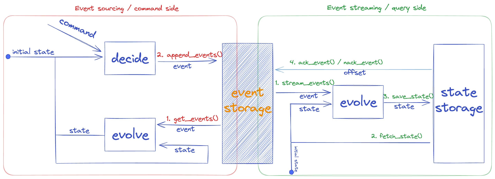
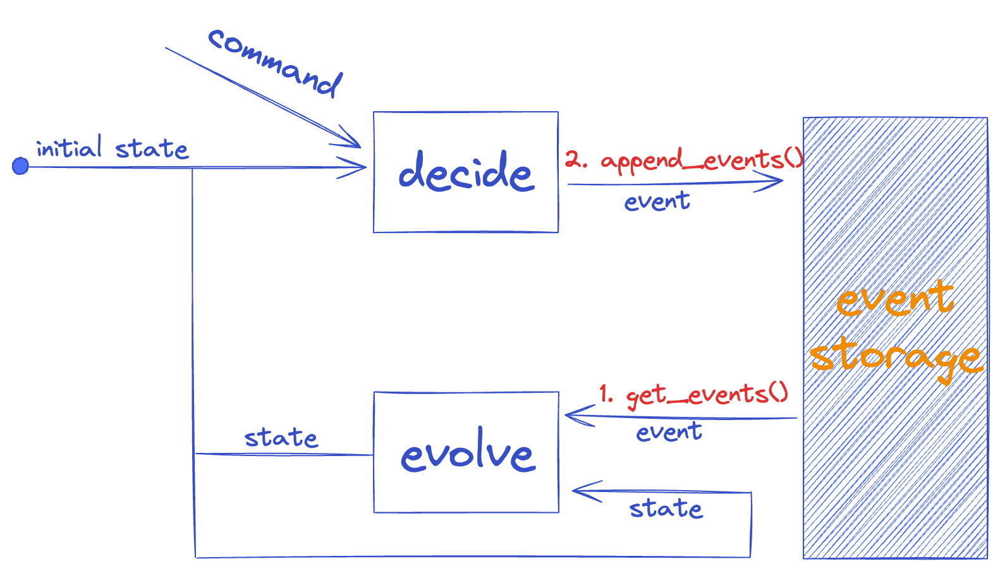
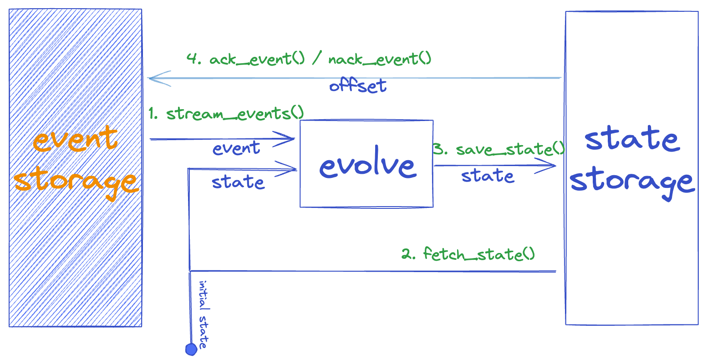

# fstore-sql (event-store, based on `postgres`)

This project offers a seamless SQL model for efficiently prototyping event-sourcing and event-streaming by using Postgres database.

**Check the [schema.sql](schema.sql) and [extensions.sql](extensions.sql)! It is all there!** No additional tools, frameworks, or programming languages are required at this level.

## Table of contents
<!-- TOC -->
* [Run Postgres](#run-postgres)
  * [Requirements](#requirements)
* [Examples of usage](#examples-of-usage)
  * [Event Sourcing](#event-sourcing)
    * [1. Registering a simple decider `decider1` with two event types it can publish: 'event1', 'event2'](#1-registering-a-simple-decider-decider1-with-two-event-types-it-can-publish-event1-event2)
    * [2. Appending two events for the decider `f156a3c4-9bd8-11ed-a8fc-0242ac120002`.](#2-appending-two-events-for-the-decider-f156a3c4-9bd8-11ed-a8fc-0242ac120002)
    * [3. Get/List events for the decider `f156a3c4-9bd8-11ed-a8fc-0242ac120002`](#3-getlist-events-for-the-decider-f156a3c4-9bd8-11ed-a8fc-0242ac120002)
  * [Event Streaming](#event-streaming)
    * [4. Registering a (materialized) view `view1` with 1 second pooling frequency, starting from 28th Jan.](#4-registering-a-materialized-view-view1-with-1-second-pooling-frequency-starting-from-28th-jan)
    * [5. Appending two events for another decider `2ac37f68-9d66-11ed-a8fc-0242ac120002`.](#5-appending-two-events-for-another-decider-2ac37f68-9d66-11ed-a8fc-0242ac120002)
    * [6a. Stream the events to concurrent consumers/views](#6a-stream-the-events-to-concurrent-consumersviews)
    * [6b. Stream the events to concurrent consumers / edge-functions (views)](#6b-stream-the-events-to-concurrent-consumers--edge-functions-views)
* [Design](#design)
* [fmodel](#fmodel)
    * [fmodel-kotlin | fmodel-ts | fmodel-rust | fmodel-java](#fmodel-kotlin--fmodel-ts--fmodel-rust--fmodel-java)
    * [FModel Demo Applications](#fmodel-demo-applications)
* [Try YugabyteDB](#try-yugabytedb)
* [References and further reading](#references-and-further-reading)
<!-- TOC -->

This model is enabling and supporting:

- `event-sourcing` data pattern (by using Postgres database) to durably store events
    - Append events to the ordered, append-only log, using `entity id`/`decider id` and `decider` type as a key
    - Load all the events for a single entity/decider, in an ordered sequence, using the `entity id`/`decider id` and `decider` type as a
      key
    - Support optimistic locking/concurrency
- `event-streaming` to concurrently coordinate read over a stream of messages from multiple consumer instances/views
    - Support real-time concurrent consumers to project events to view/query models
    - Acknowledge that event with `decider_id` and `offset` is successfully processed by the view / ACK
    - Acknowledge that event with `decider_id` is NOT processed by the view, and the view will process it again automatically / NACK
    - (Optionally) Acknowledge that event with `decider_id` is NOT processed by the view, and the view will process it again after delay / SCHEDULE NACK
 
Every decider/entity stream of events represents an independent `kafka-like` **partition**. The events within a **partition** are ordered. There is no ordering guarantee across different partitions.



**The API** is a set of SQL functions that you can use to interact with the database. You can use them in your application. The API is what you would expect from a typical event-sourcing and event-streaming database.

| SQL function / API                |    event-sourcing    |   event-streaming   |                                                                                                           description |
|:----------------------------------|:--------------------:|:-------------------:|----------------------------------------------------------------------------------------------------------------------:|
| `register_decider_event`          |  :heavy_check_mark:  |         :x:         |                                                                Register a decider and event types that it can publish |
| `append_event`                    |  :heavy_check_mark:  |         :x:         |                                                                Append/Insert new event to the database `events` table |
| `get_events`                      |  :heavy_check_mark:  |         :x:         |                                                                                       Get/List events for the decider |
| `get_last_event`                 |  :heavy_check_mark:  |         :x:         |                                                                                        Get last event for the decider |
| `register_view`                   |         :x:          | :heavy_check_mark:  |                                                                                   Register a view to stream events to |
| `stream_events`                   |         :x:          | :heavy_check_mark:  |                                                                        Stream events to the view/concurrent consumers |
| `ack_event`                       |         :x:          | :heavy_check_mark:  |                           Acknowledge that event with `decider_id` and `offset` is successfully processed by the view |
| `nack_event`                      |         :x:          | :heavy_check_mark:  |             Acknowledge that event with `decider_id` is NOT processed by the view, and the view will process it again |
| `schedule_nack_event`             |         :x:          | :heavy_check_mark:  | Acknowledge that event with `decider_id` is NOT processed by the view, and the view will process it again after delay |
| `scedule_events` (cron extension) |         :x:          | :heavy_check_mark:  |                                                                                       Schedule events to be published |


## Run Postgres

It is a Supabase Docker image of Postgres, with extensions installed:

 - [`pg_cron`](https://github.com/citusdata/pg_cron) and 
 - [`pg_net`](https://github.com/supabase/pg_net).

### Requirements

Notice that we only need these two extensions to publish events to edge-functions/HTTP endpoints/serverless applications, as explained in section `6b` below.
If you do not need to publish events directly to your serverless applications, **vanilla Postgres will work just fine!**

You can run the following command to start Postgres in a Docker container:

```shell
docker compose up -d
```


## Examples of usage

These examples are using SQL to interact with the database. Hopefully, you will find them useful, and you can use them in your application.

Import the [schema.sql](schema.sql) into your database.


### Event Sourcing

#### 1. Registering a simple decider `decider1` with two event types it can publish: 'event1', 'event2'

The `deciders` table controls the decider and event names/types that can be used in the events table itself through composite foreign keys.
It must be populated before events can be appended to the main table called `events`.

```sql
SELECT *
from register_decider_event('decider1', 'event1', 'description1', 1);
SELECT *
from register_decider_event('decider1', 'event2', 'description2', 1);
```

#### 2. Appending two events for the decider `f156a3c4-9bd8-11ed-a8fc-0242ac120002`.

Multiple constraints are applied to `events` table to ensure bad events do not make their way into the system.
This includes duplicated events, incorrect naming (event and decider names cannot be misspelled, and the client cannot insert an event from the wrong decider), ensured sequential events, disallowed delete, and disallowed update.

> Notice how `previous_id` of the second event points to `event_id` of the first event (effectively implementing optimistic locking).

```sql
SELECT *
from append_event('event1', '21e19516-9bda-11ed-a8fc-0242ac120002', 'decider1', 'f156a3c4-9bd8-11ed-a8fc-0242ac120002',
                  '{}', 'f156a3c4-9bd8-11ed-a8fc-0242ac120002', null, 1);
SELECT *
from append_event('event2', 'eb411c34-9d64-11ed-a8fc-0242ac120002', 'decider1', 'f156a3c4-9bd8-11ed-a8fc-0242ac120002',
                  '{}', 'f156a3c4-9bd8-11ed-a8fc-0242ac120002', '21e19516-9bda-11ed-a8fc-0242ac120002', 1);
```

#### 3. Get/List events for the decider `f156a3c4-9bd8-11ed-a8fc-0242ac120002`

```sql
SELECT *
from get_events('f156a3c4-9bd8-11ed-a8fc-0242ac120002', 'decider1');
```

### Event Streaming

#### 4. Registering a (materialized) view `view1` with 1 second pooling frequency, starting from 28th Jan.

The `View` must be registered before events can be streamed to it.
This streaming is kafka-like, in that it is modeling the concept of partitions and offsets.
Every unique stream of events for the one deciderId/entityId is a partition. 
`Lock` table is used to prevent concurrent access/reading to the same partition, guaranteeing that only one consumer can read from a partition at a time / guaranteeing the ordering within the partition on the reading side.

You can configure the `view` to publish event(s) every 1 second, starting from 28th Jan, 2023 with lock/ACK timeout of 300 seconds (if you dont acknowledge that you processed the event in 300 sec, the lock will be released and event will be published again, automatically).


> Notice how `lock` for the two events with `decider_id`=`f156a3c4-9bd8-11ed-a8fc-0242ac120002` is created in the
> background (using triggers).


```sql
SELECT *
from register_view('view1', 1, '2023-01-28 12:17:17.078384', 300, 'https://localhost:3000/functions/v1/event-handler');
```

#### 5. Appending two events for another decider `2ac37f68-9d66-11ed-a8fc-0242ac120002`.

The alone existence of the View is changing how `append_event` works. It is now creating a new event, but also updating a lock table.

 - `offset` / current offset of the event stream for `decider_id`
 - `offset_final` / an indicator if the offset is final / offset will not grow anymore

> Notice how `previous_id` of the second event is pointing to `event_id` of the first event.

> Notice how additional `lock` for the registered view and two new events
> with `decider_id`=`2ac37f68-9d66-11ed-a8fc-0242ac120002` created in the background (using triggers).

```sql
SELECT *
from append_event('event1', 'f7c370aa-9d65-11ed-a8fc-0242ac120002', 'decider1', '2ac37f68-9d66-11ed-a8fc-0242ac120002',
                  '{}', 'f156a3c4-9bd8-11ed-a8fc-0242ac120002', null, 1);
SELECT *
from append_event('event2', '42ee177e-9d66-11ed-a8fc-0242ac120002', 'decider1', '2ac37f68-9d66-11ed-a8fc-0242ac120002',
                  '{}', 'f156a3c4-9bd8-11ed-a8fc-0242ac120002', 'f7c370aa-9d65-11ed-a8fc-0242ac120002', 1);
```

#### 6a. Stream the events to concurrent consumers/views

`stream_events` function is used to stream events to the view.
On every event being read a lock table is updated to acquire a lock on that partition.
You can:

 - unlock the partition with `ack-event` function / acknowledge that the event with `decider_id` and `offset` is processed by the view
 - unlock the partition with `nack-event` function / acknowledge that the event with `decider_id` is NOT processed by the view, and the view should try to process it again / offset is not updated
 - schedule the partition for retry with `schedule_nack_event` function / acknowledge that the event with `decider_id` is NOT processed by the view, and the view should try to process it again after some time/offset is not updated

> Notice that this query can run in a loop within your application. 


```sql
SELECT * from stream_events('view1', 100);

SELECT * from ack_event('view1', 'f156a3c4-9bd8-11ed-a8fc-0242ac120002', 1);

-- ACK other 99 events, and call `stream_events` again to get the next 100 events.
-- If you do not ACK the events in 300 seconds as configured on the `view` table, they will be processed again on the next call to `stream_events`.
```

#### 6b. Stream the events to concurrent consumers / edge-functions (views)

Import the [extensions.sql](extensions.sql) into your database.

It is very similar to the `6a` case. The difference is that the cron job will run `SELECT * from stream_events('view1');` for you, and publish event(s) to your edge-functions/http endpoints automatically. So, the database is doing all the job. 

The `cron` job is managed(created/deleted) by triggers on the `view` table. So, whenever you register a new View, the cron job will be created automatically.


## Design

The SQL functions and schema we provide will help you to persist, query, and stream events in a robust way, but the
**decision-making** and **view-handling** logic would be something that you would have to implement on your own.

 - The decision-making process is a **command handler** responsible for handling the command/intent and producing new events/facts that can be saved in the database by using `append_event` SQL function. Command handler can be implemented in any programming language, Kotlin, TypeScript, Rust, ...
   - We call this function a **decide**.
   - You can run it as an edge function on [Supabase](https://supabase.com/docs/guides/functions) or [Deno](https://deno.com/deploy).



 - The view-handling process is an **event handler** that is responsible for handling the event/fact and producing a new view/query model. Event handler uses `stream_events` SQL function from your application to fetch/pool events, or `stream_events` SQL function is triggered by the cron job on the DB side and event(s) are published/pushed to your event handlers/HTTP endpoints/edge functions. 
   - We call this function an **evolve**.
   - You can run it as an edge function on [Supabase](https://supabase.com/docs/guides/functions) or [Deno](https://deno.com/deploy).
   - `pg_crone` and `pg_net` extensions are used to schedule the event publishing process and send the HTTP request/`event` to the edge function (view).




## fmodel

#### [fmodel-kotlin](https://github.com/fraktalio/fmodel) | [fmodel-ts](https://github.com/fraktalio/fmodel-ts) | [fmodel-rust](https://github.com/fraktalio/fmodel-rust) | [fmodel-java](https://github.com/fraktalio/fmodel-java)

'fmodel' is a set of libraries that aims to bring functional, algebraic, and reactive domain modeling to Kotlin / TypeScript / Rust / Java. It is inspired by DDD, EventSourcing, and Functional programming communities.

💙 Accelerate the development of compositional, ergonomic, data-driven, and safe applications 💙

| Command                                                                                                |                                                   Event                                                   |                                                                                                          State |
|:-------------------------------------------------------------------------------------------------------|:---------------------------------------------------------------------------------------------------------:|---------------------------------------------------------------------------------------------------------------:|
| An intent to change the state of the system                                                            |            The state change itself, a fact. It represents a decision that has already happened            |                                             The current state of the system. It has evolved out of past events |
|                                                                         |                                                                                |                                                                                     |
| -                                                                                                      |                                                     -                                                     |                                                                                                              - |
| Decide                                                                                                 |                                                  Evolve                                                   |                                                                                                          React |
| A pure function that takes command and current state as parameters, and returns the flow of new events | A pure function that takes event and current state as parameters, and returns the new state of the system | A pure function that takes event as parameter, and returns the flow of commands, deciding what to execute next |
|                                                                           |                                                                              |                                                                               |

#### FModel Demo Applications
|        |                                                                      Event-Sourced                                                                       | State-Stored   |
| :---   |:--------------------------------------------------------------------------------------------------------------------------------------------------------:|     :---:      |
| `Kotlin` (Spring) |                                          [fmodel-spring-demo](https://github.com/fraktalio/fmodel-spring-demo)                                           | [fmodel-spring-state-stored-demo](https://github.com/fraktalio/fmodel-spring-state-stored-demo) |
| `Kotlin`(Ktor)   |                                            [fmodel-ktor-demo](https://github.com/fraktalio/fmodel-ktor-demo)                                             |    todo     |
| `TypeScript`     |                                                                           todo                                                                           |    todo     |
| `Rust`           | [fmodel-rust-demo](https://github.com/fraktalio/fmodel-rust-demo) |    todo     |


## Try YugabyteDB

Alternatively, you can use YugabyteDB instead of Postgres. It is fully compatible with Postgres.

YugabyteDB is a high-performance, cloud-native distributed SQL database that aims to support all Postgres features. It
is best fit for cloud-native OLTP (i.e. real-time, business-critical) applications that need absolute data correctness
and require at least one of the following: scalability, high tolerance to failures, and globally distributed deployments.


You can [download](https://docs.yugabyte.com/preview/quick-start/install) as ready-to-use packages or installers for
various platforms.

```shell
./bin/yugabyted start --master_flags=ysql_sequence_cache_minval=0 --tserver_flags=ysql_sequence_cache_minval=0
```

Alternatively, you can run the following command
to [start YugabyteDB in a Docker](https://docs.yugabyte.com/preview/quick-start/create-local-cluster/docker/) container:

```shell
docker run -d --name yugabyte  -p7000:7000 -p9000:9000 -p5433:5433 -p9042:9042\
 yugabytedb/yugabyte:latest bin/yugabyted start\
 --daemon=false --master_flags=ysql_sequence_cache_minval=0 --tserver_flags=ysql_sequence_cache_minval=0
```


## References and further reading

- (Marco Pegoraro) https://github.com/marcopeg/postgres-event-sourcing
- (Matt Bishop) https://github.com/mattbishop/sql-event-store
- [FModel](https://fraktalio.com/fmodel/)
- [Supabase](https://supabase.io/)

---
Created with :heart: by [Fraktalio](https://fraktalio.com/) 

Excited to launch your next IT project with us? Let's get started! Reach out to our team at `info@fraktalio.com` to begin the journey to success.
